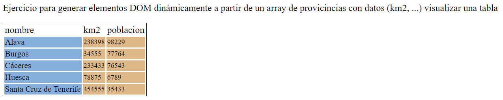

# Colecciones

[Volver](../README.md)

## Intercambios

### Intercambio de valores de 2 variables

* Solicitar dos valores numéricos, mostrarlos y sus valores intercambiados en la variables

### Rotación de 3 variables

* Solicitar tres valores, mostrarlos repetidas veces rotando sus valores
 
## Series

* Escribir  una expresión para obtener cada una de las siguientes columnas
   * 

## Intervalos

### Incluido

* Dado un intervalo, con minimo y máximo, y un punto, determinar si el punto [red]*NO* está incluido

### Intersección

* Dados dos intervalos que intersectan, mostrar el intervalo intersección de ambos

### Unión

* Dados dos intervalos que intersectan, mostrar el intervalo unión de ambos

## Estadística

## Media

* Dados unos números determinar los mayores y menores de la media

## Moda

* Dados unos números las modas

## Histograma

* Solicitar secuencia de valores entre 0 y 50, finalizada con entrada vacía, y mostrar su histograma

## Ordenar 

* Solicitar una secuencia de valores, finalizada con entrada sin valor, y mostrarlos ordenados

## Matrices

### Matriz transpuesta

* Mostrar la transpuesta de una matriz inicializada con NxM valores 1, 2, 3, ... NxM.


## Provincias

* Generar a partir de:

```
[
   {nombre:"Alava", km2:"238398", poblacion:"98229"}, 
   {nombre:"Burgos", km2:"34555", poblacion:"77764"}, 
   {nombre:"Cáceres", km2:"233433", poblacion:"76543"}, 
   {nombre:"Huesca", km2:"78875", poblacion:"6789"}, 
   {nombre:"Santa Cruz de Tenerife", km2:"454555", poblacion:"35433"}, 
]
```



## Países

### Transformador

Mostrar por consola:
** La media de áreas de todos los países
** La media de población de países

### Filtros

* Mostrar por consola:
** La media de población de paises de la región asiatica
** La media de densidad de paises de la región asiatica con población menor a 1000000
** La media de áreas de paises con area superior a la media de las áreas de todos los países
** La media de los números dados menores que 5

### Reducciones

* Mostrar por consola:
** El máximo de números
** El máximo de áreas de los países
** El máximo de áreas de la región asiatica
** El nombre del máximo de las áreas de la región asiatica
** La lista de nombres por linea
** La lista de nombres en HTML


