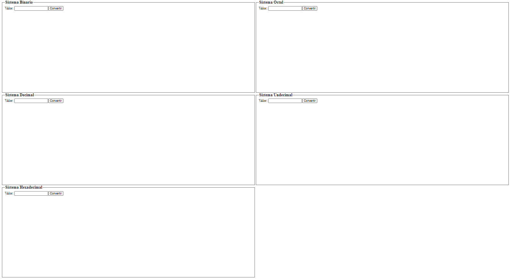
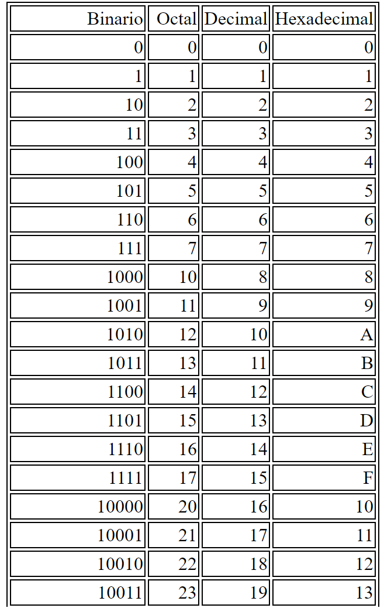
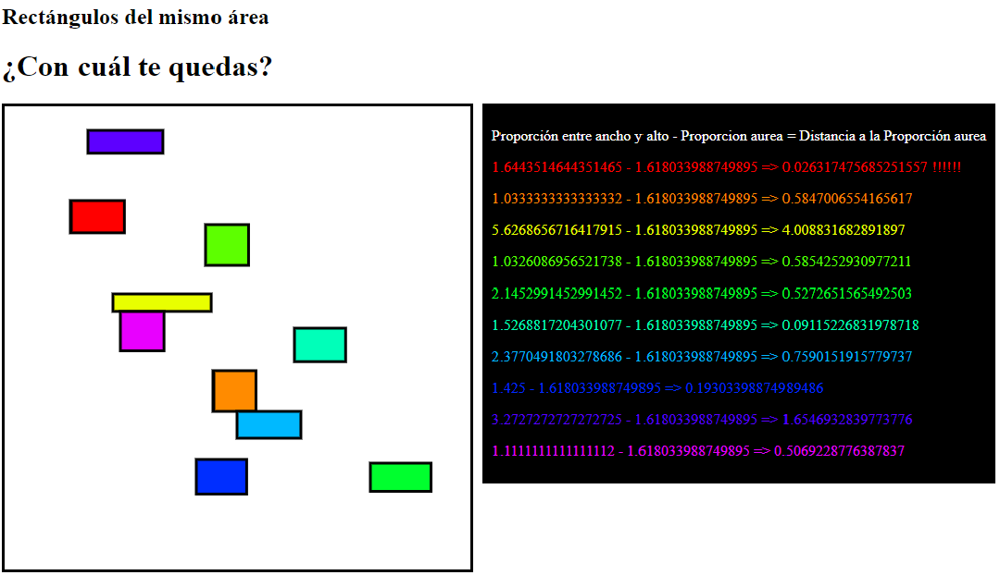
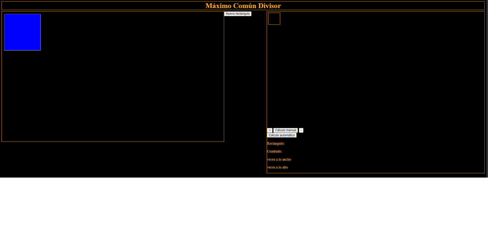
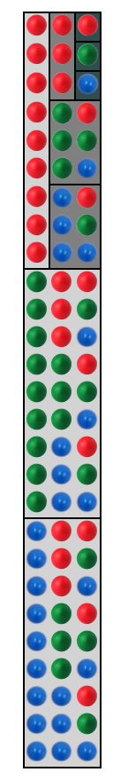

# Números

[Volver](../README.md)

## Pariedad

* Escribir un programa que solicite un número y muestre si es par o impar

## Valor Absoluto

* Escribir un programa que solicite un número y muestre su valor absoluto, en positivo

## División Entera

* Escribir un programa que solicite un número y muestre el cociente y resto de la división entera

## IVA

* Incrementar el valor de un producto con su IVA (21%) y lo que supondría un descuento del 25% de su precio

## Calificaciones

### Normativa estricta

* Expresión si has superado un módulo, teniendo en cuenta:
  * examen parcial: 20%
  * examen final: 60%
  * práctica: 40%

### Normativa relajada

* Expresión si has superado un módulo, teniendo en cuenta:
  * examen parcial: 40%
  * examen final: 60%

### Nota final

* Expresión que haga el cálculo de la nota final, valor resultante, a partir de la siguientes notas y teniendo en cuenta las ponderaciones de ejemplo anterior

## Cambio en Monedas

### Cambio en Monedas exhaustivo

* Escribir un programa que solicite una cantidad y calcule cuántas monedas de 50, 20, 10 y 5, 2 y 1 céntimos serían necesarias para cubrirlo, teniendo en cuenta que se quieren utilizar las menos posibles.
  * 3 moneda(s) de 50 
  * 0 moneda(s) de 20
  * 1 moneda(s) de 10 
  * 0 moneda(s) de 5
  * 0 moneda(s) de 2
  * 3 moneda(s) de 1

### Cambio en Monedas compacto

* Modificar el código anterior para evitar líneas de 0 monedas
  * 3 moneda(s) de 50 
  * 1 moneda(s) de 10 
  * 3 moneda(s) de 1

## Dígitos

### Primeros 3 digitos

* Solicitar un número entero y mostrar:
  * "Unidades: &lt;unidades&gt;
  * "Decenas: &lt;decenas&gt;
  * "Centenas: &lt;centenas&gt;

### Longitud

* Escribe un programa que solicite un número y muestre su cantidad de dígitos

### Palidromo

* Un número es palíndromo o capicúa (_cap i cua_, cabeza y cola en catalán) si es igual al resultado de invertir sus cifras. Por ejemplo, el número 2332 es palíndromo.

## Tablas de Multiplicar

* Solicitar un número entero y mostrar la tabla de multiplicar correspondiente

## Número Perfecto

* Un número es perfecto si la suma de sus divisores es igual a sí mismo, o sea si es amigo de sí mismo. Por ejemplo, 28 es perfecto porque sus divisores 1, 2, 4, 7 y 14 suman 28
* Escribe un programa que solicite al usuario un número y muestre si es perfecto

## Números Amigos

* Dos números son amigos si la suma de divisores de cada uno es igual al otro. 
  * Por ejemplo, 220 y 284 son amigos:
    * los divisores de 220 son 1, 2, 4, 5, 10, 11, 20, 22, 44, 55 y 110, que suman 284;
    * los divisores de 284 son 1, 2, 4, 71 y 142, que suman 220.
* Escribe un programa que solicite al usuario dos números y muestre si son o no amigos

## Numero Primo

* Un número es primo si solo es divisible por sí mismo y la unidad

### Primo

* Solicitar un número entero positivo y mostrar si es o no primo

### Suma de primos en 100 primeros

* Escribir un programa que muestre por pantalla la lista de los primos en los 100 primeros números y la suma total de éstos

### Suma de 10 primeros primos

* Escribir un programa que muestre por pantalla la lista de los 100 primeros primos y la suma total de éstos

## Sistemas de Numeración

### Conversor de Binario a Decimal

* Dado un número en binario, determinar su valor en decimal.
   * Ejemplo: 101100110= 1·2^8^ + 0·2^7^ + 1·2^6^ + 1·2^5^ + 0·2^4^ + 0·2^3^ + 1·2^2^ + 1·2^1^ + 0·2^0^ = 256 + 0+ 64 + 32 + 0 + 0 + 4 + 2 + 0 = 358

### Conversor de Decimal a Binario 

* Dado un número en binario, determinar su valor en decimal.
   * Ejemplo: 101100110= 1·2^8^ + 0·2^7^ + 1·2^6^ + 1·2^5^ + 0·2^4^ + 0·2^3^ + 1·2^2^ + 1·2^1^ + 0·2^0^ = 256 + 0+ 64 + 32 + 0 + 0 + 4 + 2 + 0 = 358

### Sistemas numericion

* blablabla
   *|  |  |

### Numero aureo

* blablabla
   * 

### Euclides

* blablabla
   * 

### Combinations

* blablabla
   * 